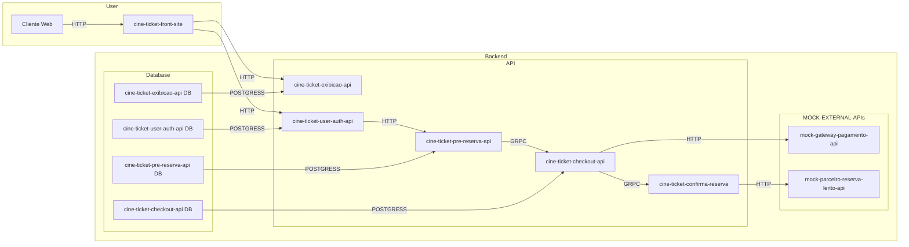

# Estudo de Caso: Implementação de Arquitetura
[              ](#projeto-de-estudo-nodejs-e-typescript)

  

---

## :arrow_heading_up: Índice
<!--ts-->

- [Estudo de Caso: Implementação de Arquitetura](#estudo-de-caso-implementação-de-arquitetura)
  - [:arrow\_heading\_up: Índice](#arrow_heading_up-índice)
  - [:green\_book: Sobre](#green_book-sobre)
  - [:camera: Imagens](#camera-imagens)
  - [:computer: Instalação](#computer-instalação)
  - [:bar\_chart: Diagramas](#bar_chart-diagramas)
  - [:hammer: Ferramentas](#hammer-ferramentas)
  - [:clap: Boas Práticas](#clap-boas-práticas)
  - [:nerd\_face: Para Desenvolvedores](#nerd_face-para-desenvolvedores)
  - [:1234: Versões](#1234-versões)

<!--te-->
---

## :green_book: Sobre

Monorepo para estudo de uma versão da arquitetura proposta no video ["Como fazer o site.x escalar?"](https://www.youtube.com/watch?v=0TMr8rsmU-k)

Não busco as melhores soluções nem o cenário perfeito (tudo sempre tem trade-offs). Pretendo resolver questões específicas e criar "APIs Mock" para serviços, com o objetivo de validar hipóteses.

Isso é um laboratório de utilização de serviços para solucionar os dois principais problemas propostos pelo video:
1. Como escalar uma funcionalidade que possui um gargalo do lado do principal fornecedor (a API de reserva de tickets).
2. Criar uma "antesala" que impeça um "flood" de requisições semelhante a um ataque DDoS.

Além dos mencionados, trabalhar com consistência eventual e implementar um conjunto de "rollbacks" de reserva caso ocorram falhas no pagamento ou na reserva (nas APIs externas "mock"). Tentar evoluir a solução para algo semelhante ao padrão de saga.

Foi utilizado o [template bootstrap gratuito FlixGo](https://www.templateshub.net/template/FlixGo-Online-Movies-Template), algumas alterações serão necessárias, pois o mesmo foi elaborado tendo sistemas de streaming em mente. A princípio, usando JavaScript puro para chamadas de API, aos poucos sendo alteradas para componentes React, aproveitando a versatilidade do gerenciador de monorepos Nx.

Pretendo construir os serviços do sistema distribuído em Node.js e Go e utilizar [Architecture decision record (ADR)](https://github.com/joelparkerhenderson/architecture-decision-record) para justificar as tomadas de decisão.

[:arrow_heading_up: voltar](#indice)

---

## :camera: Imagens
Projeto rodando local
 

 

[:arrow_heading_up: voltar](#indice)

---

## :computer: Instalação

Para executar o projeto, siga as instruções abaixo:

1. Faça o download/clone do repositório do projeto.
2. Certifique-se de ter o Docker Compose instalado em sua máquina.
3. Execute na raiz do projeto, o comando `docker-compose up` ou `docker compose up`, dependendo da versão do Docker Compose instalada.
4. Acesse `http://localhost:8080` em seu navegador para visualizar o projeto.

[:arrow_heading_up: voltar](#indice)

---

## :bar_chart: Diagramas

O diagramas abaixo ilustra a uma **proposta** de arquitetura para o projeto:

 

O fluxo de interações para o usuário comprar um assento de um filme que esteja sendo exibido, com base no diagrama fornecido, é o seguinte:

 
<ol>
  <li>
    O cliente web <b>(cine-ticket-front-site)</b> faz uma requisição HTTP para a API de exibição <b>(cine-ticket-exibicao-api)</b> para obter informações sobre os filmes em exibição.
  </li>
  <li>
    O cliente web também faz uma requisição HTTP para a API de autenticação <b>(cine-ticket-user-auth-api)</b> para realizar o login do usuário.
  </li>
  <li>
    Após o login, o cliente web interage com a API de pré-reserva <b>(cine-ticket-pre-reserva-api)</b> por meio de uma requisição HTTP para selecionar um assento disponível.
  </li>
  <li>A API de pré-reserva <b>(cine-ticket-pre-reserva-api)</b> se comunica com a API de checkout <b>(cine-ticket-checkout-api)</b> por meio de uma comunicação GRPC para iniciar o processo de checkout.</li>
  <li>A API de checkout <b>(cine-ticket-checkout-api)</b> faz uma requisição HTTP para a API de pagamento <b>(mock-gateway-pagamento-api)</b> para processar o pagamento do assento selecionado.</li>
  <li>Após o processamento do pagamento, a API de checkout <b>(cine-ticket-checkout-api)</b> faz uma requisição GRPC para a API de confirmação de reserva <b>(cine-ticket-confirma-reserva)</b> para confirmar a reserva do assento.</li>
  <li>A API de confirmação de reserva <b>(cine-ticket-confirma-reserva)</b> se comunica com a API do parceiro de reserva lenta (mock-parceiro-reserva-lento-api) por meio de uma requisição HTTP para realizar operações adicionais, se necessário.</li>
  <li>As APIs <b>(cine-ticket-checkout-api)</b> e <b>(cine-ticket-confirma-reserva)</b> se comunicam com seus respectivos bancos de dados para armazenar e recuperar informações relevantes ao processo de compra.</li>
</ol>
   
  Dessa forma, o fluxo completo de interações envolve o cliente web interagindo com as APIs de exibição, autenticação. As APIs de pré-reserva, checkout e confirmação de reserva devem ser orquestradas por uma outra API ainda a definir. Além disso, há a comunicação com as APIs externas de pagamento e parceiro de reserva lenta para processar o pagamento e realizar operações adicionais, respectivamente.

 

[:arrow_heading_up: voltar](#indice)

---

## :hammer: Ferramentas
As seguintes ferramentas foram usadas na construção do projeto:

- [Node.js](https://nodejs.org/en/)
- [Express](https://expressjs.com/en/)
- [TypeScript](https://www.typescriptlang.org/)
- [npm](https://www.npmjs.com/)
- [Nx](https://nx.dev/)
- [Docker](https://www.docker.com/)

[:arrow_heading_up: voltar](#indice)

---

## :clap: Boas Práticas
Seguindo boas práticas de desenvolvimento:
- [Semantic Versioning 2.0.0](https://semver.org/spec/v2.0.0.html)
- [keep a changelog](https://keepachangelog.com/en/1.0.0/)
- [Conventional Commits](https://www.conventionalcommits.org/en/v1.0.0/)
- [Mermaid Diagrams](https://mermaid.js.org)
- [Monorepo](https://monorepo.tools/)
- [Architecture decision record (ADR)](https://github.com/joelparkerhenderson/architecture-decision-record)

[:arrow_heading_up: voltar](#indice)

---

## :nerd_face: Para Desenvolvedores
Nada do que for discutido nessa seção deve atrapalhar o [correto funcionamento e instalação](#computer-instalação) do projeto em uma máquina com o docker-compose funcional

Durante o estudo/desenvolvimento, foram adotadas as ferramentas [Nx](https://nx.dev/) (que requer Nodejs em sua máquina) e seu [console no VScode](https://marketplace.visualstudio.com/items?itemName=nrwl.angular-console) para a gestão de Monorepos. Para uma experiência de desenvolvimento e validação técnica do repositório, [sugiro instalação do ambiente de gerenciamento](https://docs.npmjs.com/downloading-and-installing-node-js-and-npm). Explicar o funcionamento do Nx não é o objetivo do presente documento (até mesmo porque também estou aprendendo), mas [encorajo a buscar esses dados](https://nx.dev/getting-started/intro) caso deseje. [Qualquer Monorepo pode se tornar um monorepo Nx](https://blog.nrwl.io/adding-nx-to-an-existing-monorepo-by-running-one-command-426fa519d943).

Tenha bons estudos :)
<!-- `npx nx dep-graph` é MARAVILHOSO -->
[:arrow_heading_up: voltar](#indice)

---

## :1234: Versões
Para obter mais informações, consulte o [Histórico de Versões](./CHANGELOG.md).

[:arrow_heading_up: voltar](#indice)

