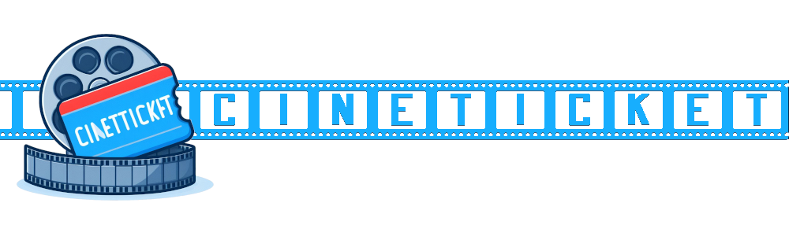
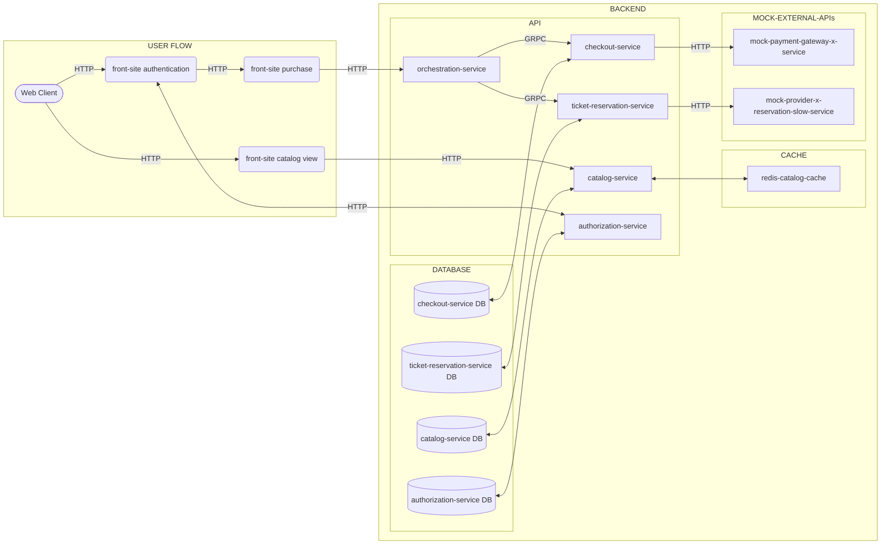

# Estudo de Microsservices para Venda de Ingressos - CineTicket

<!-- 
    Logo image generated by Bing IA: https://www.bing.com/images/create/
    Font file by dafont: https://www.dafont.com/pt/cinema-st.font?text=CineTicket&psize=l
-->

          <!-- icons by https://simpleicons.org/?q=types -->

   

 

#### 🕸️ Minhas Redes:
     

---

## :arrow_heading_up: Índice
<!--ts-->

- [Estudo de Microsservices para Venda de Ingressos - CineTicket](#estudo-de-microsservices-para-venda-de-ingressos---cineticket)
  :arrow_heading_up: [Índice](#arrow_heading_up-índice) 
  :green_book: [Sobre](#green_book-sobre) 
  :camera: [Imagens](#camera-imagens) 
  :computer: [Instalação](#computer-instalação) 
  :bar_chart: [Diagramas](#bar_chart-diagramas) 
  :hammer: [Ferramentas](#hammer-ferramentas) 
  :clap: [Boas Práticas](#clap-boas-práticas) 
  :nerd_face: [Para Desenvolvedores](#nerd_face-para-desenvolvedores) 
  :1234: [Versões](#1234-versões) 
  :robot: [Uso de IA](#ia)

<!--te-->
---

## :green_book: Sobre

Monorepo para estudo de arquitetura de venda de ingressos similar ao video ["Como fazer o ingressos.x escalar?"](https://www.youtube.com/watch?v=0TMr8rsmU-k)

Não busco as melhores soluções nem o cenário perfeito (tudo sempre tem trade-offs). Pretendo resolver questões específicas e criar "APIs Mock" para serviços, com o objetivo de validar hipóteses e aos poucos escalar para algo totalmente funcional.

Isso é um laboratório de utilização de serviços para solucionar os dois principais problemas propostos pelo video:
1. Como escalar uma funcionalidade que possui um gargalo do lado do principal fornecedor (a API de reserva de tickets).
2. Criar uma "antesala" que impeça um "flood" de requisições semelhante a um ataque DDoS.

Além dos mencionados, trabalhar com consistência eventual e implementar um conjunto de "rollbacks" de reserva caso ocorram falhas no pagamento ou na reserva (nas APIs externas "mock"). Tentar evoluir a solução para algo semelhante ao padrão de saga.

Devo criar o projeto aumentando aos poucos seu escopo do zero ao deploy.

Foi utilizado o [template bootstrap gratuito FlixGo](https://www.templateshub.net/template/FlixGo-Online-Movies-Template), algumas alterações serão necessárias, pois o mesmo foi elaborado tendo sistemas de streaming em mente. A princípio, usando JavaScript puro para chamadas de API, aos poucos sendo alteradas para componentes React, aproveitando a versatilidade do gerenciador de monorepos Nx.

Pretendo construir os serviços do sistema distribuído em Node.js e Go e utilizar [Architecture decision record (ADR)](https://github.com/joelparkerhenderson/architecture-decision-record) para justificar as tomadas de decisão.

[:arrow_heading_up: voltar](#indice)

---

## :camera: Imagens
Projeto rodando local
 

 

[:arrow_heading_up: voltar](#indice)

---

## :computer: Instalação

Para executar o projeto, siga as instruções abaixo:

1. Faça o download/clone do repositório do projeto.
2. Certifique-se de ter o Docker Compose instalado em sua máquina.
3. Execute na raiz do projeto, o comando `docker-compose up` ou `docker compose up`, dependendo da versão do Docker Compose instalada.
4. Acesse `http://localhost:8080` em seu navegador para visualizar o projeto.

[:arrow_heading_up: voltar](#indice)

---

## :bar_chart: Diagramas

O diagrama abaixo ilustra a uma **proposta** de arquitetura para o projeto:

 

O fluxo de interações para o usuário comprar um assento de um filme que esteja sendo exibido, com base no diagrama fornecido, é o seguinte:

 
<ol>
  <li>
    Acesso à visualização do cine-ticket-front-site: O usuário pode acessar a interface de visualização do cine-ticket-front-site (representado pela seta "Cliente Web" -> "cine-ticket-front-site visualizacao").
  </li>
  <li>
    Autenticação no cine-ticket-front-site: O usuário pode realizar o processo de autenticação no cine-ticket-front-site (representado pela seta "Cliente Web" -> "cine-ticket-front-site autenticacao" -> "cine-ticket-user-auth-api").
  </li>
  <li>
    Compra no cine-ticket-front-site: Após a autenticação, o usuário pode prosseguir com a compra no cine-ticket-front-site (representado pela seta "Cliente Web" -> "cine-ticket-front-site compra" -> "cine-ticket-orchestration-api" -> "cine-ticket-checkout-api" -> "mock-gateway-pagamento-api" e "cine-ticket-confirma-reserva" -> "mock-parceiro-reserva-lento-api").
  </li>
</ol>
 
  Dessa forma, o fluxo completo de interações envolve o cliente web interagindo com as APIs de exibição, autenticação. As APIs de checkout e reserva devem ser orquestradas por uma outra API ainda a definir, responsável pelo processo de roolback em caso de falhas.

 

[:arrow_heading_up: voltar](#indice)

---

## :hammer: Ferramentas
As seguintes ferramentas foram usadas na construção do projeto:

- [Node.js](https://nodejs.org/en/)
- [Express](https://expressjs.com/en/)
- [TypeScript](https://www.typescriptlang.org/)
- [npm](https://www.npmjs.com/)
- [Nx](https://nx.dev/)
- [Docker](https://www.docker.com/)

[:arrow_heading_up: voltar](#indice)

---

## :clap: Boas Práticas
Seguindo boas práticas de desenvolvimento:
- [Semantic Versioning 2.0.0](https://semver.org/spec/v2.0.0.html)
- [keep a changelog](https://keepachangelog.com/en/1.0.0/)
- [Conventional Commits](https://www.conventionalcommits.org/en/v1.0.0/)
- [Mermaid Diagrams](https://mermaid.js.org)
- [Monorepo](https://monorepo.tools/)
- [Architecture decision record (ADR)](https://github.com/joelparkerhenderson/architecture-decision-record)

[:arrow_heading_up: voltar](#indice)

---

## :nerd_face: Para Desenvolvedores
Nada do que for discutido nessa seção deve atrapalhar o [correto funcionamento e instalação](#computer-instalação) do projeto em uma máquina com o docker-compose funcional

Durante o estudo/desenvolvimento, foram adotadas as ferramentas [Nx](https://nx.dev/) (que requer Nodejs em sua máquina) e seu [console no VScode](https://marketplace.visualstudio.com/items?itemName=nrwl.angular-console) para a gestão de Monorepos. Para uma experiência de desenvolvimento e validação técnica do repositório, [sugiro instalação do ambiente de gerenciamento](https://docs.npmjs.com/downloading-and-installing-node-js-and-npm). Explicar o funcionamento do Nx não é o objetivo do presente documento (até mesmo porque também estou aprendendo), mas [encorajo a buscar esses dados](https://nx.dev/getting-started/intro) caso deseje. [Qualquer Monorepo pode se tornar um monorepo Nx](https://blog.nrwl.io/adding-nx-to-an-existing-monorepo-by-running-one-command-426fa519d943).

Tenha bons estudos :)
<!-- `npx nx dep-graph` é MARAVILHOSO -->
[:arrow_heading_up: voltar](#indice)

---

## :1234: Versões
Para obter mais informações, consulte o [Histórico de Versões](./CHANGELOG.md).

[:arrow_heading_up: voltar](#indice)

---

### :robot: Uso de IA:

O cabeçalho desta página foi criado com a fonte [cinema-st](https://www.dafont.com/pt/cinema-st.font?text=CineTicket&psize=l) e o auxílio de inteligência artificial e um mínimo de 
retoque e construção no Gimp 

__Foram utilizados os seguintes prompts para sua criação no [Bing IA:](https://www.bing.com/images/create/)__

  
<b>Ingresso de cinema com rolo de filme</b>

<i>"logotipo para um site de venda de ingressos de cinema estilo cartoon simplificado chamado cineticket, UM ingresso de cinema Azul com detalhes vermelhos rodeado por um negativo de rolo de filme de cinema com fundo branco"<b>(sic)</b></i>

 

IA também é utilizada em minhas pesquisas e estudos como ferramenta de apoio; no entanto, __artes e desenvolvimento são, sobretudo, atividades criativas humanas.__

Contrate artistas para projetos comerciais ou mais elaborados e Aprenda Engenhosidade!

[:arrow_heading_up: voltar](#indice)
