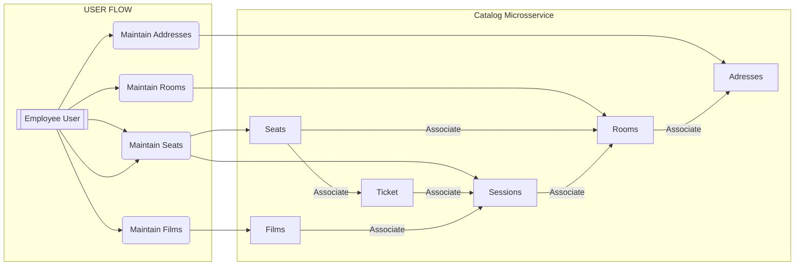
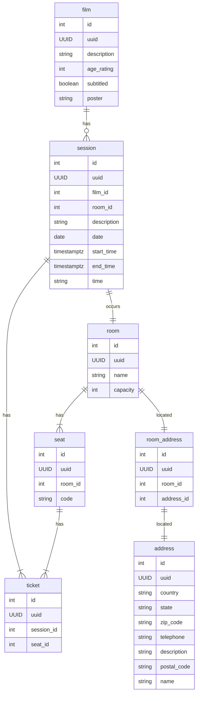

# Catalog Microsservice
[            ](#projeto-de-estudo-nodejs-e-typescript)

<!-- [Nx Monorepo for Building Microservices -- Getting started #01](https://www.youtube.com/watch?v=NtdGXeiP9mE)-->

---

## :arrow_heading_up: Índice
<!--ts-->

- [Catalog Microsservice](#catalog-microsservice)
  :arrow_heading_up: [Índice](#arrow_heading_up-índice)
  :green_book: [Sobre](#green_book-sobre)
  :bar_chart: [Diagramas](#bar_chart-diagramas)

Para **Decisões Arquiteturais** consulte nosso **[ADR](./ADR.md)**

---

## :green_book: Sobre
Microsserviço responsável pelo gerenciamento do catálogo de filmes, salas de cinema e assentos, bem como pela disponibilização de informações aos clientes sobre filmes, sessões e  ingressos para sessões específicas. 

[:arrow_heading_up: voltar](#indice)

---

## :bar_chart: Diagramas

**Diagrama de Fluxo:**

  

**Diagrama Entidade Relacionamento:**

[:arrow_heading_up: voltar](#indice)
